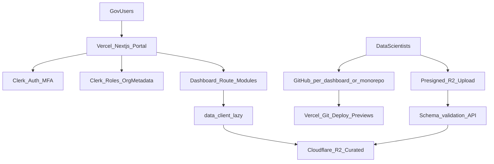
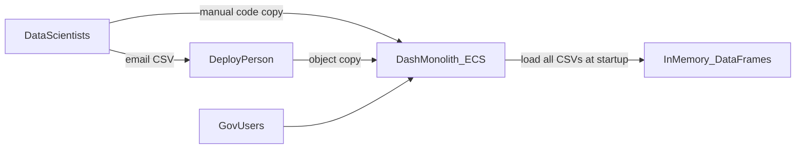
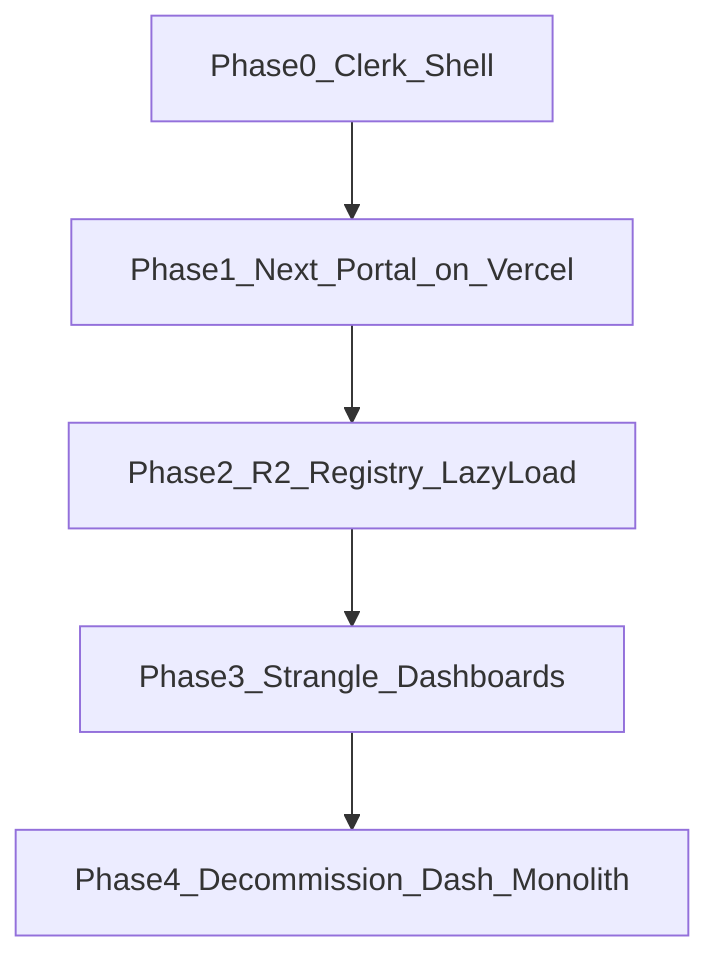

# System Architecture & Migration Plan

**Locked design:** Analytics **Dashboard Platform** on **Vercel** (London/`lhr1` where available) with **Clerk** for authentication/authorisation and **Cloudflare R2** as the curated object store, migrated from the Dash monolith via a **strangler-fig** path.

No application code is included in this deliverable — diagrams, decisions, migration, and a scoped MVP plan only.

**Build sequence:** [mvp-playbook.md](mvp-playbook.md) (Parts A & B — assessment focus) · [implementation-guide.md](implementation-guide.md) (full A–F)

---

## 1. Problem statement

| Pain | Impact |
|------|--------|
| Manual code copy into one monolith | Slow releases, merge conflicts, single blast radius |
| CSVs emailed then copied to object storage | Insecure, unauditable, stale data |
| All CSVs loaded into memory at startup | Memory bloat; unused dashboards still cost RAM |
| Custom SHA256 password auth | Not enterprise-grade; no SSO / MFA / federation |
| Path-based authz inside the app | Hard to reason about; duplicates identity concerns |

**Preserve:** data-scientist local DX (CSV on laptop), unified UI, granular access control.

**Scale:** ~20 data scientists × ≥5 dashboards (~100 apps), ~100 daily government users. **UK-oriented** hosting and data locality.

**Chosen stack (constraint):** Vercel (hosting) · Clerk (auth) · Cloudflare R2 (objects).

---

## 2. Why this stack fits (and what it implies)

| Choice | Fit | Implication |
|--------|-----|-------------|
| **Vercel** | Git-connected deploys, preview envs per PR, edge/middleware, scales for ~100 DAU with almost no ops | Plotly **Dash (long-lived Python WSGI)** is a poor match for Vercel serverless. Target UX is a **Next.js** portal + dashboard modules (Plotly.js / React), not “lift Dash onto Vercel”. |
| **Clerk** | Hosted auth, MFA, orgs/roles, Next.js SDK, session in middleware | Replaces custom password DB for AuthN; map Clerk roles/org membership → dashboard entitlements for AuthZ. |
| **Cloudflare R2** | S3-compatible API, no egress fees to Cloudflare, private buckets, presigned URLs | Replaces emailed CSVs + ad-hoc S3 copies; dashboards fetch **only** their datasets on demand (lazy load). |

**Honest constraint — UK residency:** Prefer Vercel project region **London (`lhr1`)** when available; R2 **EU jurisdiction** buckets (Cloudflare’s closest dedicated residency control — document acceptance with InfoSec). Clerk: use an org/instance configuration that meets departmental residency guidance (see [security.md](security.md)).

---

## 3. Target architecture

Open the draw.io system design: [`architecture.drawio`](architecture.drawio) (diagrams.net / VS Code Draw.io).

### Layer choices

| Layer | Choice | Rationale |
|-------|--------|-----------|
| Hosting | Vercel (Next.js App Router) | Unified UI, preview devs, CI via Git; right-sized for 100 users |
| AuthN | Clerk (email/SSO + MFA) | Enterprise login without owning a password store |
| AuthZ | Clerk Organizations / Roles / public metadata → dashboard IDs | Granular access; catalogue filters in middleware/server components |
| Object store | Cloudflare R2 (private, EU jurisdiction) | Curated datasets; S3-compatible tooling; lazy fetch |
| Dashboards | Route modules (or packages) in the Next app; optional microfrontends later | Independent ownership without ECS/K8s |
| Data access | Shared `data_client` pattern: local CSV in dev, R2 in prod | Ends import-time memory dump; preserves laptop DX |
| CI/CD | GitHub → Vercel (preview + production); protect `main` | No human copy into a monolith |
| DX | Template dashboard package + `datasets` manifest; local CSV mount | Same schema local → R2 |

### Unified UI

1. User hits the Next.js portal on Vercel.
2. Clerk middleware authenticates; server reads roles/metadata.
3. Catalogue shows only permitted dashboards.
4. Each dashboard route loads **only its** datasets via R2 (presigned GET or server-side fetch with scoped credentials).
5. No process-wide “load every CSV at startup.”

---

## 4. Current state

Sample repo today: single Plotly Dash app, three dashboard modules, PostgreSQL password auth, CSVs read at import time.

---

## 5. Migration strategy (strangler fig)

| Phase | Duration (sketch) | Focus | Exit criteria |
|-------|-------------------|--------|---------------|
| **0 – Clerk shell** | 1–2 weeks | Clerk in front of existing app *or* parallel Next shell with links to legacy Dash | SSO pilot; passwords no longer primary for pilot users |
| **1 – Next portal on Vercel** | 2–4 weeks | Catalogue + RBAC from Clerk; legacy Dash behind feature flag/iframe or reverse proxy during transition | Unified entry URL; preview deploys for portal PRs |
| **2 – R2 registry** | 4–8 weeks | Presigned upload + schema check; curated R2 keys; lazy load API; stop email CSV | All prod datasets in R2; no startup memory dump for new routes |
| **3 – Strangle dashboards** | 1–2 quarters | Reimplement high-churn Dash pages as Next/Plotly.js modules (or embed until rewritten) | Independent release ownership per team/module |
| **4 – Decommission** | When traffic clear | Retire ECS Dash monolith | Single Vercel platform path |

**Principle:** each phase ships value and is reversible. We do **not** pretend Dash runs natively as a long-lived WSGI worker on Vercel.

---

## 6. Recommended 1-hour MVP (design only — not implemented)

Pick **one** sharp slice that proves the story in the paired session:

### Preferred MVP narrative

**“Clerk-protected Next.js catalogue on Vercel + R2 dataset manifest”**

| Piece | What you would show |
|-------|---------------------|
| Auth | Clerk sign-in; middleware guards `/dashboards/*` |
| Catalogue | Static or config-driven list filtered by Clerk role (`customer_analytics`, etc.) |
| Data | Manifest mapping `dataset_id` → R2 object key; one API route that returns a **presigned GET** (or fetches CSV server-side) |
| DX | Same CSV files locally when `DATA_SOURCE=local` |

This maps to architecture in one sentence: *“This is the platform shell and the lazy data path; Dash modules get strangled next.”*

### Alternate MVP (if staying closer to the sample repo for the hour)

Document-only walkthrough of wiring **Clerk** as IdP in front of the existing Dash container (hosted elsewhere temporarily) while the **portal** is already on Vercel — still no password-primary auth for new users. Prefer the Next catalogue MVP if the assessor expects alignment with “Vercel for hosting.”

---

## 7. Developer experience (preserved)

- **Local:** template repo with sample CSVs; `data_client` reads local files with the same IDs as R2 keys.
- **Contract:** each dashboard exports route, `required_permission`, and `datasets[]`.
- **PR previews:** Vercel preview deployments replace “copy into monolith for staging.”
- **Data publish:** authenticated upload → validate schema → write `curated/…` in R2 (not email).

---

## 8. Alternatives considered (not v1)

| Approach | Why not primary |
|----------|-----------------|
| Lift Dash onto Vercel serverless | Dash/Gunicorn/WebSocket model ≠ Vercel functions |
| AWS ECS / EKS | Explicitly out of scope for this design |
| Keep password DB | Fails enterprise auth requirement; Clerk replaces it |
| Stay forever on modular Dash monolith | Acceptable only as interim during Phases 0–2 |

---

## 9. Paired-session talking points

- **Why Vercel:** ops-light for 100 DAU; preview envs fix the deployment process pain; unified UI as Next.js.
- **Why not Dash-on-Vercel:** runtime mismatch; strangler to Plotly.js/React is the maintainable path.
- **Why Clerk:** MFA, orgs/roles, Next middleware; kill custom SHA256 auth.
- **Why R2:** curated object store, S3-compatible, lazy per-dashboard fetch; ends email CSV.
- **UK posture:** Vercel London region + R2 EU jurisdiction + Clerk residency settings — call out residual risk to InfoSec.
- **Migration honesty:** Phase 0–2 can leave Dash running briefly; success is strangling, not a big-bang rewrite.
