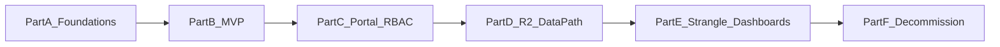

# Implementation Guide — Step by Step

Practical build sequence for the locked stack: **Vercel** (Next.js portal) · **Clerk** (auth) · **Cloudflare R2** (datasets), strangling the Plotly Dash monolith.

Companion docs: [architecture.md](architecture.md) · [security.md](security.md) · [architecture.drawio](architecture.drawio)

**Assessment focus:** execute only [mvp-playbook.md](mvp-playbook.md) (**Parts A & B**). Parts C–F below are the post-MVP roadmap for the paired session.

This guide is ordered so each step leaves a working system. Do not skip residency/security setup early — rework is expensive.

---

## How to use this guide

| Audience | Path |
|----------|------|
| **Assessment / paired session** | Complete **Part A (Day-0 foundations)** + **Part B (1-hour MVP)**; narrate Parts C–F as the roadmap |
| **Real delivery** | Execute Parts A → F in order; use exit checklists before advancing |



---

## Part A — Day-0 foundations (before writing features)

### A1. Confirm constraints with stakeholders

1. Agree **UK-leaning** posture: Vercel London (`lhr1` when available), R2 **EU jurisdiction**, Clerk residency settings (see [security.md](security.md)).
2. Record residual risk (e.g. R2 EU vs UK-only) and get InfoSec acknowledgement in writing.
3. Confirm scale assumptions still hold (~100 dashboards, ~100 daily users).
4. Name owners: platform (portal/auth/R2) vs data scientists (dashboard modules/datasets).

**Done when:** short decision log exists (region, IdP, object store, who owns what).

### A2. Provision accounts and projects

1. Create a **Clerk** application (production + development instances).
2. Create a **Cloudflare** account; enable **R2**; create a bucket with **EU jurisdiction** (e.g. `analytics-curated-eu`).
3. Create a **Vercel** team/project (empty Next.js app is fine for now).
4. Set Vercel project region toward **London** when the UI/API allows.
5. Create a GitHub repo (or monorepo) for the portal — do **not** continue hand-copying into the Dash monolith for new work.

**Done when:** all three vendors have a named project/bucket and access is limited to the platform team.

### A3. Wire secrets (empty app is OK)

In Vercel project settings (Preview + Production):

| Variable | Notes |
|----------|--------|
| `NEXT_PUBLIC_CLERK_PUBLISHABLE_KEY` | Client-safe |
| `CLERK_SECRET_KEY` | Server-only |
| `R2_ACCOUNT_ID` | Cloudflare account |
| `R2_ACCESS_KEY_ID` | R2 API token — server-only |
| `R2_SECRET_ACCESS_KEY` | Server-only |
| `R2_BUCKET` | e.g. `analytics-curated-eu` |
| `R2_JURISDICTION` | `eu` (document in runbook) |
| `DATA_SOURCE` | `r2` in prod; `local` in local `.env` |

Never put R2 secrets in `NEXT_PUBLIC_*`.

**Done when:** production and preview env groups both have Clerk + R2 vars; local `.env.example` lists names without values.

### A4. Define contracts (config before code)

Create (in Git) two manifests — even if empty of real data:

**`config/dashboards.yaml` (or JSON)** — catalogue contract:

```yaml
dashboards:
  - id: customer_analytics
    title: Customer Analytics
    path: /dashboards/customer-analytics
    required_permission: customer_analytics
    datasets: [customer_data]
```

**`config/datasets.yaml`:**

```yaml
datasets:
  customer_data:
    local_path: customer_data.csv
    r2_key: curated/customer/customer_data.csv
```

Map sample-repo permissions (`customer_analytics`, `sales_dashboard`, `financial_reports`) 1:1 into Clerk roles later.

**Done when:** IDs match today’s Dash routes/permissions so strangler can be 1:1.

### A5. Clerk RBAC model

1. Enable **Organizations** (or decide on user public metadata if orgs are overkill for v1).
2. Create roles or permissions: `customer_analytics`, `sales_dashboard`, `financial_reports`, `admin` (all).
3. Create three pilot users mirroring the sample (`admin`, `analyst1`, `scientist1` entitlements).
4. Turn on **MFA** for the production instance (or enforce for the gov org).

**Done when:** you can describe “scientist1 sees only Customer” without referring to the Postgres password DB.

---

## Part B — 1-hour MVP (assessment slice)

Goal: prove **shell + auth + lazy data path** without rewriting all Dashboards.

### B1. Scaffold Next.js on Vercel (≈10 min)

1. `create-next-app` (App Router, TypeScript).
2. Connect the GitHub repo to Vercel; confirm a preview deploy on PR.
3. Add a trivial `/` page (“Analytics Platform”) so the pipeline is green.

### B2. Add Clerk (≈15 min)

1. Install Clerk’s Next.js SDK; add middleware protecting `/dashboards(.*)` and `/api(.*)`.
2. Add `<SignIn />` / `<SignUp />` (or hosted) routes.
3. Verify unauthenticated users cannot open `/dashboards`.
4. Read the session on the server; log `userId` (no PII beyond what’s needed).

### B3. Catalogue filtered by role (≈15 min)

1. Load `config/dashboards.yaml`.
2. Resolve the signed-in user’s permissions from Clerk (role or metadata).
3. Render cards/links **only** for allowed dashboards.
4. Hard-deny direct URL access to a dashboard the user lacks (server check, not CSS hide).

### B4. R2 (or local) dataset fetch (≈20 min)

1. Implement one API route, e.g. `GET /api/datasets/[id]/presign` (or server-side CSV fetch).
2. Look up `id` in `datasets.yaml`; reject unknown IDs.
3. Check the caller’s Clerk session + that some dashboard they can access lists that dataset.
4. If `DATA_SOURCE=local`, read from `/data`; if `r2`, issue a **short-TTL presigned GET** (or fetch with S3-compatible client against R2).
5. Add one stub dashboard page that loads `customer_data` and shows row count or a simple Plotly.js chart.

**MVP exit checklist**

- [ ] Preview deploy works from GitHub
- [ ] Clerk login required for dashboards
- [ ] Catalogue respects roles
- [ ] One dataset loads without import-time “load all CSVs”
- [ ] You can say in one sentence: *“This is the portal and lazy data path; Dash gets strangled next.”*

---

## Part C — Full portal & transitional coexistence (Phase 0–1)

### C1. Production portal hardening

1. Lock down Clerk production (MFA, allowed redirect URLs, no public sign-up if gov-only).
2. Add security headers in Next.js config (CSP tuned for Clerk + Plotly).
3. Structured access logs: `userId`, `dashboardId`, `timestamp`, `result`.
4. Error pages that do not leak stack traces or dataset keys.

### C2. Keep legacy Dash available during strangler

Pick **one** coexistence pattern:

| Option | When to use |
|--------|-------------|
| **A. Links out** | Portal lists legacy Dash URLs (still on current host) for not-yet-migrated pages |
| **B. Embed** | iframe legacy Dash behind portal chrome (cookie/auth bridging is harder — prefer A unless required) |
| **C. Reverse proxy** | Edge rewrite `/legacy/*` to old origin; portal owns `/` and `/dashboards/*` |

1. Put coexistence behind a feature flag (`LEGACY_DASH_ORIGIN`).
2. Document that legacy still uses old auth until each page is strangled — pilot users should use Clerk on the portal first.

### C3. Map Clerk → legacy permissions (temporary)

1. Table or config: Clerk `userId` / email → old Postgres username or permission set.
2. Prefer **not** inventing a second long-lived password path for new users.
3. Plan expiry: remove mapping when Phase 3 completes for that dashboard.

### C4. CI/CD policy

1. Protect `main`: PR required; Vercel preview must be green.
2. Ban “copy DS code into monolith” for anything going through the portal.
3. Optional: GitHub Action that only validates manifests/YAML schema on PR.

**Phase 1 exit checklist**

- [ ] Single entry URL for users (portal)
- [ ] SSO/MFA for pilot cohort
- [ ] Preview environments replace manual staging copies for portal work
- [ ] Legacy Dash reachable only as an explicit transitional path

---

## Part D — R2 data platform (Phase 2)

### D1. Bucket layout and IAM

```
<bucket>/
  landing/<domain>/<dataset>/<timestamp>_file.csv
  curated/<domain>/<dataset_id>.csv   # or versioned keys
```

1. Create two R2 API tokens if possible: **upload** (landing write) vs **read** (curated read) — least privilege.
2. Block public bucket access; no public object ACLs.
3. Enable versioning if available / keep dated keys for audit.

### D2. Upload API (replace email CSV)

1. Authenticated UI or CLI: DS requests upload for `dataset_id`.
2. API checks Clerk role (e.g. `data_publisher` or dashboard owner role).
3. Return **presigned PUT** to `landing/...` with content-type and max size.
4. On completion webhook or client callback → run **schema validation** (columns/types vs contract).
5. On success: copy/promote to `curated/...` and update manifest version; on failure: leave in landing + notify.

### D3. Lazy read path everywhere new

1. Central `loadDataset(datasetId)` used by all Next dashboard modules.
2. TTL cache in memory or Redis only if needed — default short-lived; never load unrelated datasets.
3. Audit log every presign/fetch.
4. Stop instructing teams to email CSVs; update runbook and reject email-based publishes.

### D4. Local DX parity

1. `DATA_SOURCE=local` + `DATA_ROOT=./data` for laptop work.
2. Same `dataset_id`s as R2; sample CSVs from this repo seed local folders.
3. Document: “develop on CSV → publish via portal to R2.”

**Phase 2 exit checklist**

- [ ] No production dataset depends on email
- [ ] New dashboards never load all datasets at startup
- [ ] Manifest is source of truth for object keys
- [ ] Upload + validation path used by at least one DS team

---

## Part E — Strangle dashboards (Phase 3)

Work **one dashboard at a time** (start with highest churn or simplest).

### E1. Per-dashboard migration runbook

For dashboard `X`:

1. **Freeze** feature work on the Dash module for `X` (bugfixes only).
2. Recreate charts in a Next.js route module using Plotly.js (or agreed viz lib) reading via `loadDataset`.
3. Match `required_permission` and path to the manifest.
4. Add Playwright/Cypress smoke: login as entitled + forbidden user.
5. Flip catalogue link from legacy → new route (feature flag).
6. Monitor logs/errors for 1–2 weeks.
7. Remove legacy Dash route for `X`.

### E2. Template for data scientists

Publish a cookiecutter / example package:

- Folder layout for a dashboard module
- `datasets` declaration
- Local run instructions
- PR checklist (preview URL, permission, dataset contract)

### E3. Ownership model

1. Platform owns: Clerk, R2 policies, portal chrome, `loadDataset`, CI templates.
2. DS owns: chart logic, dataset schema for their domain, publish cadence.
3. Optional later: split large domains into separate Next apps / monorepo packages if blast radius demands it — not required at ~100 DAU.

**Phase 3 exit checklist (per dashboard)**

- [ ] New route live and flagged default
- [ ] Legacy route removed or 410’d
- [ ] Permissions verified
- [ ] Dataset only via R2/local client

**Phase 3 exit checklist (programme)**

- [ ] Majority of traffic on Next modules
- [ ] Remaining legacy list is explicit and short

---

## Part F — Decommission Dash monolith (Phase 4)

1. Confirm zero (or accepted residual) traffic to legacy origin.
2. Export any audit/user tables still needed; archive Postgres.
3. Decommission ECS/Fargate (or whatever hosts Dash); revoke old secrets.
4. Remove coexistence flags, iframe/proxy config, Clerk→Postgres maps.
5. Update architecture diagram and runbooks to “Vercel-only.”
6. Retire demo password accounts from the sample era.

**Phase 4 exit checklist**

- [ ] Single platform path on Vercel
- [ ] Clerk-only AuthN
- [ ] R2-only curated data in prod
- [ ] Legacy host powered off / DNS removed

---

## Suggested calendar (delivery, not assessment)

| Week | Focus |
|------|--------|
| 0 | Part A foundations + InfoSec sign-off |
| 1 | Part B MVP → expand to production portal (C1) |
| 2–3 | Coexistence + pilot users (C2–C4) |
| 4–8 | R2 upload/validate/lazy load (Part D) |
| 9+ | Strangle dashboards one-by-one (Part E) |
| Later | Decommission (Part F) |

Assessment timebox: **Part A (light) + Part B** in the coding hour; bring Parts C–F as the migration plan with [architecture.drawio](architecture.drawio).

---

## Verification matrix (what “good” looks like)

| Requirement | How you prove it |
|-------------|------------------|
| Preserve DS local DX | Local CSV + same `dataset_id`; template repo |
| Unified UI | Single Vercel portal catalogue |
| Granular access | Clerk roles + server-side denial |
| Enterprise auth | Clerk MFA / SSO; no password-primary |
| Automate deploy | Git → Vercel preview/prod |
| Scalable / maintainable | Module-per-dashboard; no monolith merge |
| UK-oriented hosting | lhr1 + R2 EU + Clerk settings documented |
| Fix memory dump | Lazy `loadDataset` only |
| Fix email CSV | Presigned landing → curated |

---

## Rollback principles

1. **Feature flags** for catalogue targets (new vs legacy).
2. Keep R2 `curated/` immutable versions so a bad publish can pin a previous key.
3. Vercel instant rollback to previous deployment.
4. Never delete the Dash host in the same change set as the first cutover of a critical dashboard.

---

## Out of scope for v1 (do not block the path above)

- Running Plotly Dash as a long-lived WSGI app on Vercel
- Full multi-cluster Kubernetes platform
- Column-level lakehouse governance (can follow once R2 + validation exist)
- Rewriting all ~100 dashboards before pilots succeed
